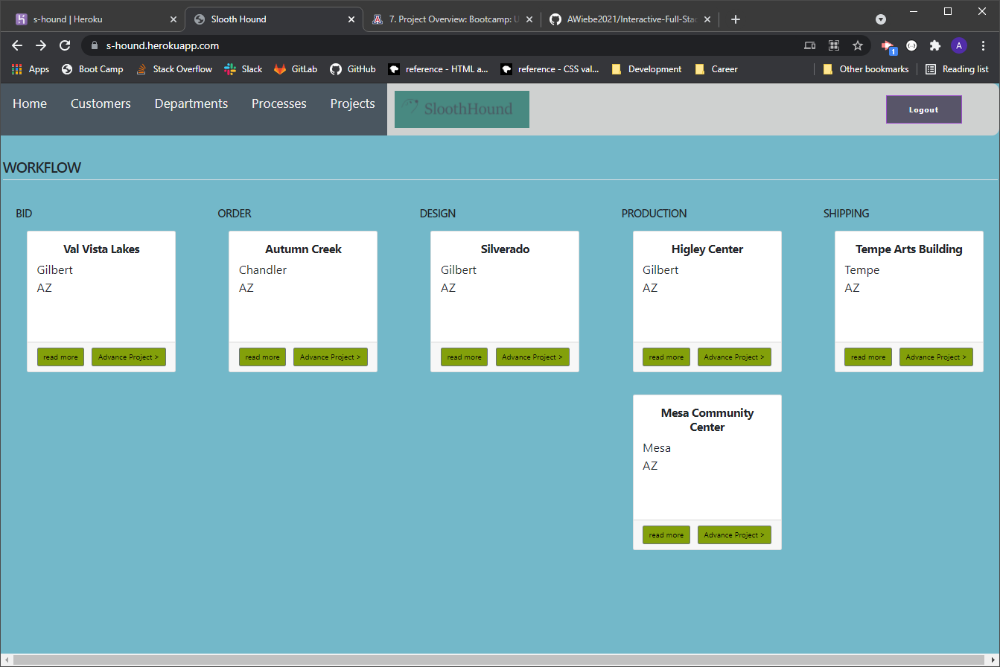

# Collaborative Interactive-Full-Stack-Project

Slooth Hound

## Description 

Collaborative Interactive-Full-Stack-Project: Slooth Hound
an app that allows the user to visually see the projects in the workflow of the company, with the ability to drill down to view the department and the projects that department is currently responsible for. The app will have a SQL back end with customer and project status information. This app will also have the ability for the company to setup the milestones it wants to track and responsible departments. A additional feature is that each department could establish its own milestones to track the progress of the project within that department.

Challenge Elements
The requirements for this project ask us to use the skills and technologies we’ve learned over the past six weeks (deployment, interactivity, client-side storage, responsive design, polished UI).

They also ask us to use some of the less obvious skills we’ve practiced in the lessons and in your class. We’ve learned that there are many frameworks used in web development. 

Technologies Used 
●HTML/CSS/Git 
●JavaScript 
●Sequelize package  
●Handlebars.js  
●MySQL2 
●Express.js 
●Dotenv 
●Bootstrap 
●The DOM 
●APIs 
●JQuery 
●JSON 

Your project should fulfill the following requirements: 

  [X]  Be deployed to GitHub Pages. 
  [X]  Be interactive (i.e., accept and respond to user input). 
  [X]  Use at least two server-side APIs. 
  [X]  Does not use alerts, confirms, or prompts (use modals). 
  [X]  Use client-side storage to store persistent data. 
  [X]  Be responsive. 
  [X]  Have a polished UI. 
  [X]  Have a clean repository that meets quality coding standards (file structure, naming conventions, follows best practices for class/id naming conventions, indentation, quality comments, etc.). 
  [X]  Have a quality README (with unique name, description, technologies used, screenshot, and link to deployed application). 
  [X]  Finally, you must add your project to the portfolio that you created in Module 2. 

## Installation

The project can be viewed at: https://s-hound.herokuapp.com/  
The projects code can be accessed at: https://github.com/AWiebe2021/Interactive-Full-Stack-Project

## Screenshot

## Credits
Team 1
Aaron Wiebe - https://awiebe2021.github.io/awiebe-portfolio/  
Valeria Mercado - https://sxwqsd.github.io/  

David Grogan 
Matthew Parker 